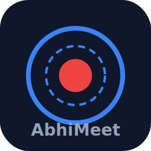

<p align="center">
  
</p>

<h1 align="center">AbhiMeet</h1>

<p align="center">
  <strong>Free, open-source meeting recorder with AI transcription & reporting via Claude MCP</strong>
</p>

<p align="center">
  <a href="#installation"></a>
  <a href="LICENSE"></a>
  <a href="#mcp-tools-15"></a>
  <a href="#supported-languages"></a>
  <a href="https://github.com/abhishekjoshi-eng/AbhiMeet/stargazers"></a>
</p>

<p align="center">
  <b>Drop Fireflies.ai. Record locally. Let Claude do the rest.</b><br/>
  Record meetings with audio + screen capture. Whisper AI transcribes locally in 90+ languages. Claude generates meeting minutes, action items, summaries, and reports — all through MCP.
</p>

---

## Why AbhiMeet?

| Feature | Fireflies.ai | AbhiMeet |
|---------|:-----------:|:--------:|
| Monthly cost | $19-39/user | **Free forever** |
| Data storage | Their cloud | **Your local disk** |
| Privacy | Uploads to cloud | **100% offline** |
| Languages | Limited | **90+ via Whisper** |
| AI Reports | Built-in (limited) | **Claude AI (unlimited)** |
| Screen recording | No | **Yes** |
| Custom reports | No | **Yes — MOM, action items, decisions, anything** |
| Open source | No | **Yes — MIT License** |

## Demo

```
You:     "Transcribe my latest recording"
Claude:  Transcribing Budget-Review_160426_0230PM... Detected Hindi (92% confidence)
         Transcribed 47 segments in 12 seconds. Saved.

You:     "Generate meeting minutes with action items"
Claude:  ## Meeting Minutes — Budget Review (16 Apr 2026)
         ### Action Items:
         1. Abhishek to finalize vendor quotes by Friday
         2. Send revised budget to accounts team
         ...
```

## Features

- **One-Click Recording** — Single button to record mic + system audio + screen simultaneously
- **3 Output Files Per Recording:**
  - `Subject_Audio_DDMMYY_HHMMam.mp3` — Audio only (for Claude transcription)
  - `Subject_Video_DDMMYY_HHMMam.webm` — Screen only (for visual analysis)
  - `Subject_AV_DDMMYY_HHMMam.mp4` — Combined audio + video (for sharing)
- **Live Audio Waveform** — Real-time visualization with frequency bars so you know recording is working
- **Recording Feedback** — Animated indicators: "Audio capturing", "Screen capturing", "Saving to disk"
- **Built-in Media Player** — Audio, Video, and Combined tabs with native playback
- **Whisper AI Transcription** — Local speech-to-text (no API key, no internet required)
- **Video Frame Extraction** — Claude can "see" what was on screen during the meeting
- **15 MCP Tools** — Full Claude integration for transcription, summaries, reports
- **Multi-Language** — English, Hindi, Gujarati, Marathi, Bengali, Kutchi + 90 more
- **Configurable Storage** — Browse and set your own recording folder
- **Dark Theme UI** — Clean, professional, distraction-free interface
- **Zero Subscription** — No cloud, no account, no recurring payments

## Installation

### Prerequisites
- [Node.js](https://nodejs.org/) v18+ 
- [Python](https://python.org/) v3.10+
- [uv](https://docs.astral.sh/uv/) — fast Python package manager
- [FFmpeg](https://ffmpeg.org/) — for audio/video processing

### Quick Setup

```bash
# 1. Clone
git clone https://github.com/abhishekjoshi-eng/AbhiMeet.git
cd AbhiMeet

# 2. Install the Electron app
cd app
npm install
cd ..

# 3. Install the MCP server + Whisper
cd mcp-server
uv sync
cd ..

# 4. Download FFmpeg (Windows)
# Download from https://www.gyan.dev/ffmpeg/builds/
# Place ffmpeg.exe and ffprobe.exe in app/ffmpeg/

# 5. Run!
cd app
npx electron .
```

### Connect to Claude Desktop (Cowork)

Add this to `%APPDATA%/Claude/claude_desktop_config.json`:

```json
{
  "mcpServers": {
    "abhimeet": {
      "command": "uv",
      "args": ["--directory", "C:/path/to/AbhiMeet/mcp-server", "run", "main.py"]
    }
  }
}
```

### Connect to Claude Code

Add this to `.claude/.mcp.json`:

```json
{
  "mcpServers": {
    "abhimeet": {
      "command": "uv",
      "args": ["--directory", "/path/to/AbhiMeet/mcp-server", "run", "main.py"]
    }
  }
}
```

Restart Claude. You'll see 15 AbhiMeet tools available.

## MCP Tools (15)

| Tool | What It Does |
|------|-------------|
| `list_recordings` | List all meeting recordings with metadata |
| `get_recording_info` | Get full details about a specific recording |
| `get_audio_file_path` | Get path to the audio MP3 for analysis |
| `get_video_file_path` | Get path to the screen recording WebM |
| `get_combined_file_path` | Get path to the combined A+V MP4 |
| `transcribe_recording` | **Transcribe audio using Whisper AI** (runs locally, no API key) |
| `extract_video_frames` | **Extract screen frames** so Claude can see what was shown |
| `save_transcription` | Save transcription text to the recording folder |
| `read_transcription` | Read back a saved transcription |
| `save_summary` | Save a meeting summary |
| `read_summary` | Read a saved summary |
| `save_report` | Save reports — MOM, action items, decisions, follow-ups |
| `search_recordings` | Full-text search across all recordings |
| `get_storage_stats` | Storage usage and disk space stats |
| `delete_recording` | Delete a recording and all its files |

## How It Works

```
Record Meeting          Whisper Transcribes        Claude Analyzes
    |                        |                         |
    v                        v                         v
[AbhiMeet App]  --->  [MCP Server]  --->  [Claude Desktop/Code]
    |                        |                         |
    v                        v                         v
3 files saved         Speech -> Text            Reports, MOM,
(MP3+WebM+MP4)     (90+ languages)          Action Items, Summary
```

## Usage Examples

After connecting to Claude, just talk naturally:

| What You Say | What Happens |
|-------------|-------------|
| *"List my recordings"* | Shows all recordings with dates, durations, file types |
| *"Transcribe my latest recording"* | Whisper runs locally, saves transcription |
| *"Generate meeting minutes"* | Claude reads transcription, creates structured MOM |
| *"What action items came up?"* | Extracts and lists all commitments and deadlines |
| *"Summarize in Hindi"* | Generates summary in Hindi from English recording |
| *"What was shown on screen?"* | Extracts video frames, Claude describes visual content |
| *"Search recordings for 'budget'"* | Finds all recordings mentioning budget |

## File Naming Convention

Every recording creates a folder with 3 properly named files:

```
Budget-Review_160426_0230PM/
    Budget-Review_Audio_160426_0230PM.mp3      (Audio only)
    Budget-Review_Video_160426_0230PM.webm     (Screen only)
    Budget-Review_AV_160426_0230PM.mp4         (Combined)
    metadata.json                              (Recording metadata)
```

Format: `Subject_Type_DDMMYY_HHMMam.ext`

## Supported Languages

Powered by Whisper AI — supports **90+ languages** including:

| Language | Code | Language | Code |
|----------|------|----------|------|
| English | en | Hindi | hi |
| Gujarati | gu | Marathi | mr |
| Bengali | bn | Tamil | ta |
| Telugu | te | Kannada | kn |
| Urdu | ur | Punjabi | pa |
| Arabic | ar | Chinese | zh |
| Japanese | ja | Korean | ko |
| French | fr | German | de |
| Spanish | es | Portuguese | pt |

## Project Structure

```
AbhiMeet/
  app/                          # Electron desktop app
    src/
      main/                     # Main process
        index.js                # App window, permissions, tray
        ipc-handlers.js         # Recording logic, 3-file output
        file-manager.js         # FFmpeg conversion, file naming
        settings.js             # Settings + MCP config sync
        tray.js                 # System tray
      renderer/                 # Frontend UI
        index.html              # Dark theme, waveform, player
        styles.css              # Professional dark UI
        app.js                  # Recording, playback, waveform
      preload.js                # Secure IPC bridge
    assets/icon.svg             # App icon
    ffmpeg/                     # FFmpeg binaries (not in repo)
    package.json
  mcp-server/                   # Python MCP server
    main.py                     # 15 tools + Whisper transcription
    config.json                 # Storage path config
    pyproject.toml              # Dependencies
  recordings/                   # Auto-created recording storage
  LICENSE                       # MIT License
  README.md
```

## Tech Stack

| Component | Technology | Purpose |
|-----------|-----------|---------|
| Desktop App | **Electron 33** | Cross-platform recording UI |
| Audio/Video | **FFmpeg** | MP3 conversion, A+V merging |
| Transcription | **faster-whisper** | Local Whisper AI (no cloud) |
| AI Integration | **MCP (Model Context Protocol)** | Claude tools |
| MCP Server | **FastMCP (Python)** | 15-tool server |
| UI | **HTML/CSS/JS** | Dark theme with live waveform |

## Contributing

Contributions are welcome! Feel free to:
- Open issues for bugs or feature requests
- Submit pull requests
- Add support for more platforms (macOS, Linux)
- Improve Whisper model selection
- Add speaker diarization

## Roadmap

- [ ] macOS and Linux support
- [ ] Speaker diarization (who said what)
- [ ] Auto-record when Zoom/Meet/Teams call starts
- [ ] Calendar integration for auto-naming
- [ ] Export reports to PDF/Word
- [ ] Electron auto-updater

## License

MIT License - see [LICENSE](LICENSE) for details.

## Author

**Abhishek Tansukh Joshi**  
GitHub: [@abhishekjoshi-eng](https://github.com/abhishekjoshi-eng)

---

<p align="center">
  <b>If AbhiMeet saved you a Fireflies subscription, give it a star!</b><br/>
  <a href="https://github.com/abhishekjoshi-eng/AbhiMeet">https://github.com/abhishekjoshi-eng/AbhiMeet</a>
</p>
